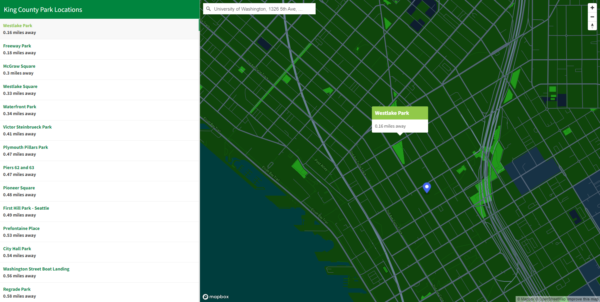

# City of Seattle Park Locations

## Description 
This project is a web GIS application that displays the location of parks that are owned and operated by the city of Seattle. This application does not display parks that are owned and operated by other entities within Seattle. 

**Project Link:** https://alexanderlyu.github.io/seattle-parks/

## Project Goal 
The goal of this project is to assist people living in or visiting Seattle to explore some of the city's parks. There is a very large range of beautiful and fun parks all around Seattle. This project allows users to conveniently find parks that are nearby. Users can also use this to plan out other trips if they are traveling around the city.

## Functionality
 Besides displaying the location of each park, users can also find the distance from each park to a certain location by searching for an address in the search bar. Parks are ordered in the list by distance to the address. Clicking on the parks listed on the sidebar to the left will move the view to the location of the park. The selected park will display a tooltip with the distance from the entered location.

## Data Sources
King County Parks data for this project came from [King County Open GIS](https://gis-kingcounty.opendata.arcgis.com/). The data was modified by myself in order to only contain park information concerning those owned and operated by the City of Seattle. The data was last updated on March 31, 2021. 

## Acknowledgements

- This project was created for Geography 495, taught at the University of Washington by Professor Bo Zhao and TA Xiaoqi "Steven" Bao. Many thanks to both of them. 
- This project uses the Mapbox JL JS API, Mapbox Geocoder API, and Turf.js API
- The basemap for this project was created using Mapbox Studio. 
